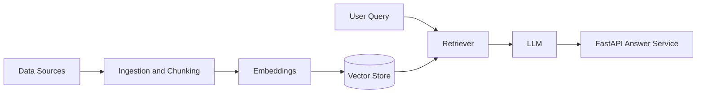
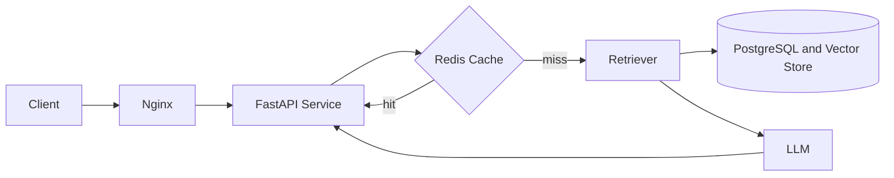
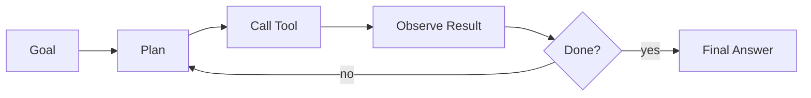

Bengaluru, India

  

---

## About

Backend and AI engineer with about two years of experience, currently at **BiggWorks** (Vithamas Technologies). I build production systems in Python: APIs, scraping and automation pipelines, RAG-based AI applications and distributed infrastructure.

I like turning AI from a demo into a dependable backend service: fast, observable, cached and easy to deploy.

---

## AI & LLM Engineering

  
  
  
  
  
  

| Area | What I work on |
|---|---|
| **RAG systems** | Document ingestion, chunking strategies, embeddings, vector retrieval and grounded answers |
| **LLM applications** | Prompt design, LLM API integration, structured outputs and response handling |
| **AI backends** | Async FastAPI services, Redis caching, PostgreSQL storage, Docker deployment |
| **Data for AI** | Scraping and automation pipelines that collect and clean data for retrieval systems |
| **Exploring** | AI agents with tool use, retrieval quality and evaluation |

### How I design a RAG system

### How I serve AI in production

### Agent loop I'm exploring

---

## Highlights

- Built a **50-node distributed cluster** processing **millions of records** with high uptime and a significant reduction in infrastructure cost
- Engineered a **real-time IoT backend** serving high daily API volume at low latency
- Developing **RAG systems** with vector retrieval, containerised services and caching
- Designed **scraping and automation pipelines** with Selenium and Playwright for large-scale data collection
- Shipped **secure REST APIs** with FastAPI and Django, using JWT authentication and PostgreSQL

---

## Tech Stack

  

 

| | |
|---|---|
| **Languages** | Python, JavaScript, SQL |
| **Frameworks** | FastAPI, Django, Django REST Framework, React |
| **Data** | PostgreSQL, Redis, MongoDB, MySQL |
| **Infrastructure** | Docker, Nginx, Linux, Raspberry Pi clusters |
| **Automation** | Selenium, Playwright |
| **Tools** | Git, GitHub, Postman |

---

## Education

**MCA**, PES College of Engineering

---

### Let's Connect

Open to conversations about backend engineering, AI systems and automation.

