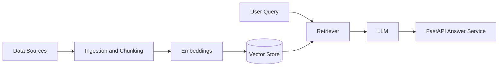

<h1 align="center">Chirag S</h1>

📍 Bengaluru, India

  

---

## About

Backend and AI engineer with about two years of experience, currently at **BiggWorks** (Vithamas Technologies). I build production systems in Python: APIs, scraping and automation pipelines, RAG-based AI applications and distributed infrastructure. I care about reliability, performance and clean system design, and I like building AI features that run as dependable backend services rather than demos.

---

## AI & LLM Engineering

- **RAG pipelines:** document ingestion, chunking, embeddings, vector retrieval and grounded answers
- **LLM-powered applications:** prompt design, LLM API integration and structured responses
- **AI backends:** async FastAPI services, Redis caching, PostgreSQL storage and Docker-based deployment
- **Data for AI:** scraping and automation pipelines that collect and clean data for retrieval systems
- **Exploring:** AI agents and tool use, retrieval quality and evaluation

### How I approach a RAG system

---

## Highlights

- Built a **50-node distributed cluster** processing **millions of records** with high uptime and a significant reduction in infrastructure cost
- Engineered a **real-time IoT backend** serving high daily API volume at low latency
- Developing **RAG systems** with vector retrieval, containerised services and caching
- Designed **scraping and automation pipelines** with Selenium and Playwright for large-scale data collection
- Shipped **secure REST APIs** with FastAPI and Django, using JWT authentication and PostgreSQL

---

## Tech Stack

| | |
|---|---|
| **Languages** | Python, JavaScript, SQL |
| **Frameworks** | FastAPI, Django, Django REST Framework, React |
| **Data** | PostgreSQL, Redis, MongoDB, MySQL |
| **Infrastructure** | Docker, Nginx, Linux, Raspberry Pi clusters |
| **Automation** | Selenium, Playwright |
| **Tools** | Git, GitHub, Postman |

  

---

## Education

**MCA**, PES College of Engineering

---

### Let's Connect

Open to conversations about backend engineering, AI systems and automation.

